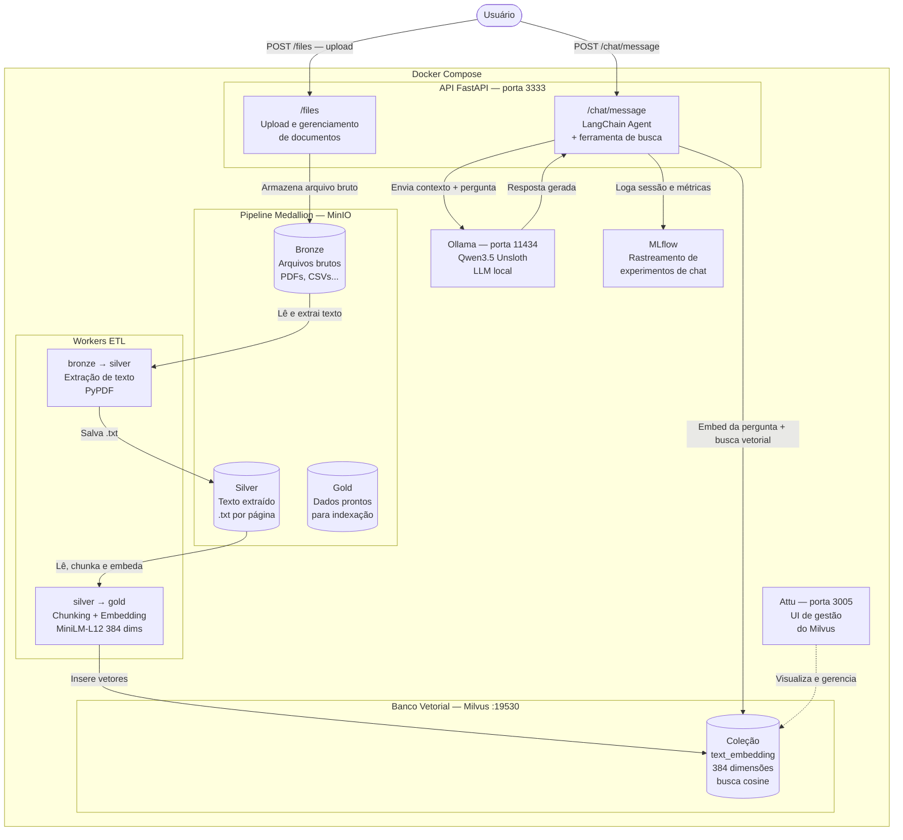

# Sistema de Análise de Consumo Energético Residencial

## 👥 Integrantes

| Nome | RA |
|------|-----------|
| Cristian Henrique Belo | 211648 |
| Fellipe Alessandro Scruph | 222378 |
| Gabriel Souza | 222709 |
| Guilherme Matheus Fonseca Waizbart | 211899 |
| Guilherme Romualdo de Oliveira Freitas | 211709 |
| João Victor de Oliveira | 212106 |
| Renan Vizoto Ferreira | 222220 |
| Vinicius Cândido das Chagas | 211873 |
| William Wurschig | 211657 |

---

## 📋 Assunto

O dataset escolhido e o **Energy consumption of the Netherlands** (Luca Basanisi), que contem dados de consumo de eletricidade e gas na Holanda, coletados por sete distribuidoras regionais (Enexis, Liander, Stedin, Enduris, Westlandinfra, Rendo e Coteq). Os dados sao agregados por faixa de CEP (minimo 10 conexoes para anonimizacao) e cobrem multiplos anos.

## 🎯 Domínio

**Eficiência energética residencial**

## 🎯 Objetivo

Desenvolver um sistema baseado em **Retrieval Augmented Generation (RAG)** capaz de consultar e analisar dados do estudo de consumo elétrico residencial, permitindo que usuários façam perguntas sobre:

- Padrões de uso de energia
- Comportamento de consumo
- Oportunidades de eficiência energética

## 🏗️ Arquitetura do Sistema

O sistema é composto por serviços orquestrados via Docker Compose, divididos em três responsabilidades principais: **ingestão de dados**, **pipeline ETL (Medallion)** e **interface de chat RAG**.



### Fluxo de dados

1. **Ingestão** — O usuário faz upload de documentos (PDFs) via `/files`. Os arquivos são armazenados no bucket **Bronze** do MinIO.
2. **Bronze → Silver** — Um worker extrai o texto dos documentos (PyPDF) e salva como `.txt` no bucket **Silver**, uma página por arquivo.
3. **Silver → Gold** — Outro worker divide o texto em chunks (`CharacterTextSplitter`), gera embeddings de 384 dimensões com o modelo `paraphrase-multilingual-MiniLM-L12-v2` e indexa os vetores no **Milvus**. Os dados indexados representam a camada **Gold**.
4. **Chat RAG** — O usuário faz uma pergunta via `/chat/message`. O agente LangChain embeda a pergunta, realiza busca cosine no Milvus (top 3 resultados), monta o contexto e envia ao **Ollama** (Qwen3.5) para geração da resposta. Cada sessão é registrada no **MLflow**.

---

## 🚀 Como iniciar o projeto (Makefile)

O repositório inclui um `Makefile` na raiz para facilitar o setup e a execução via Docker Compose.

### Pré-requisitos

- Docker e Docker Compose
- `make`
- (Opcional) `curl` para download dos modelos GGUF

### Primeira execução

```bash
# 1. Baixar modelos (embedding + Ollama) para volumes/
make setup-all

# 2. (Opcional) Copiar variáveis de ambiente
cp .env.example .env

# 3. Subir toda a stack
make up
```

Na primeira vez, o download dos modelos pode demorar. O Ollama sobe por padrão com **Qwen3.5 0.8B** (`qwen3.5-0.8b-unsloth`).

O container Ollama executa um **warmup automático** do modelo padrão no startup (`ollama-warmup.sh`), absorvendo o cold start (~3 min em GPUs com 4GB VRAM) antes da API ficar disponível. A API só sobe após o Ollama passar no healthcheck.

Variáveis úteis no `.env`:

| Variável | Default | Descrição |
|----------|---------|-----------|
| `OLLAMA_KEEP_ALIVE` | `30m` | Tempo que o modelo permanece na VRAM entre requisições |
| `OLLAMA_WARMUP_ENABLED` | `true` | Desative (`false`) para pular warmup em dev |
| `OLLAMA_NUM_PREDICT` | `128` | Limite de tokens gerados por resposta |

### Fluxo do chat (RAG agentico)

1. Usuário envia pergunta em `POST /chat/message`
2. O agente LangChain decide chamar a tool `search`
3. A busca vetorial consulta Milvus (governança + metadados MLflow)
4. O agente responde com base nos resultados da tool

### GPU (NVIDIA / AMD / CPU)

O Makefile detecta a GPU automaticamente. Para forçar um perfil:

```bash
make gpu-info          # mostra perfil detectado e arquivos compose usados
make up                # auto: nvidia → amd → cpu
make up GPU=nvidia     # docker-compose.nvidia.yml
make up GPU=amd        # docker-compose.amd.yml (ROCm)
make up GPU=cpu        # sem override de GPU
```

Atalhos: `make up-nvidia`, `make up-amd`, `make up-cpu`.

### Modelo de inferência

O modelo padrão é configurável via `.env` ou na linha de comando:

```bash
make up OLLAMA_MODEL=qwen3.5-0.8b-unsloth
```

Na API, é possível escolher outro modelo permitido por requisição:

```bash
curl -X POST http://localhost:3333/chat/message \
  -H "Content-Type: application/json" \
  -d '{"message": "Qual modelo foi treinado?", "model": "gemma4-unsloth"}'
```

### Pipeline de treinamento (Dutch Energy)

Coloque os CSVs do Kaggle em `notebooks/data/` e execute:

```bash
make train              # bronze → silver → gold → XGBoost + MLflow
make train-force        # reprocessa silver/gold e retreina
```

### Comandos úteis

| Comando | Descrição |
|---------|-----------|
| `make help` | Lista todos os targets disponíveis |
| `make down` | Para todos os serviços |
| `make restart` | Reinicia a stack |
| `make logs` | Acompanha logs dos containers |
| `make ps` | Status dos containers |
| `make setup-embeddings` | Baixa apenas o modelo de embedding |
| `make setup-ollama-qwen` | Baixa apenas o GGUF do Qwen 0.8B |
| `make setup-ollama-gemma` | Baixa apenas o GGUF do Gemma |
| `make test-unit` | Roda testes unitários |
| `make clean-volumes` | Remove volumes gerados (destrutivo) |

### Portas principais

| Serviço | URL |
|---------|-----|
| API FastAPI | http://localhost:3333 |
| Ollama | http://localhost:11435 |
| MLflow | http://localhost:5001 |
| MinIO Console | http://localhost:9001 |
| Attu (Milvus UI) | http://localhost:3005 |

---

## 📌 Links Úteis

- **Dataset**: [Energy consumption of the Netherlands](https://www.kaggle.com/datasets/lucabasa/dutch-energy)
- **Trello**: [Watttrack - Projeto de Gestão](https://trello.com/invite/b/69aa0fb5e3b7f2d77018470d/ATTIf6ec617a20231c8f424b4a28aa2b04b5F5307FFE/watttrack)
